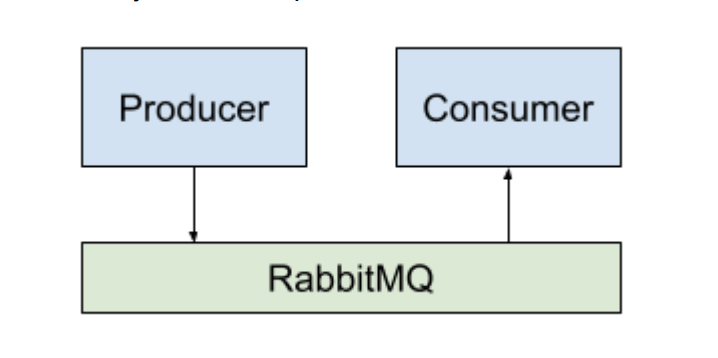
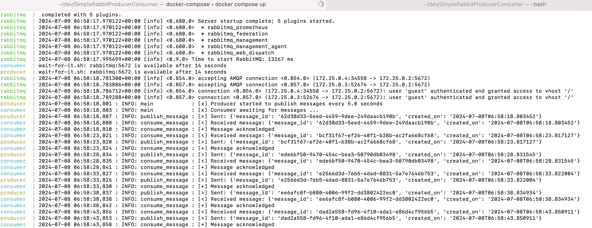
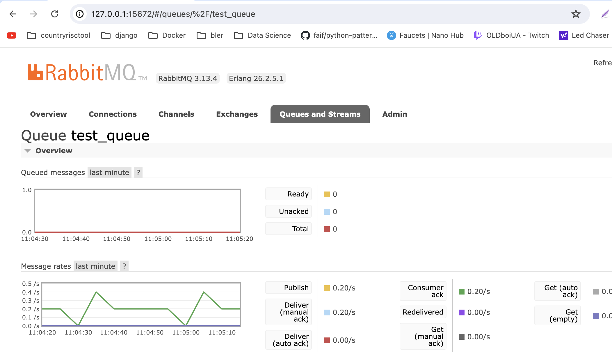

# SimpleRabbitProducerConsumer README 

This project demonstrates the use of RabbitMQ with asynchronous Python consumers and producers using the `aio-pika` library. The setup involves Docker containers for RabbitMQ, the producer, and the consumer.


*Img.1 General Workflow*

### Project Structure

```
SimpleRabbitProducerConsumer/
├── producer_aio_pika.py
├── consumer_aio_pika.py
├── Dockerfile.producer
├── Dockerfile.consumer
├── docker-compose.yml
├── logs/
└── wait-for-it.sh
```


### Setup and Installation

1. **Clone the repository:**
   ```sh
   git clone https://github.com/Madaocv/SimpleRabbitProducerConsumer.git
   ```

   ```sh
   cd SimpleRabbitProducerConsumer
   ```
2. **Ensure Docker is running.**

3. **Build the Docker images:**
   ```sh
   docker-compose build
   ```

### Running the Project

1. **Start the services:**
   
   ```sh
   docker-compose up
   ```
   Front mode: Runs all containers in the foreground.
   
   *Img.2 Logs Example*

   
   ```sh
   docker-compose up -d
   ```
   Or Background mode: Runs all containers in the background (detached mode).
2. The `wait-for-it.sh` script ensures that the producer and consumer wait for RabbitMQ to be fully ready before attempting to connect.

### Viewing Logs

Logs for both the producer and the consumer are written to a shared volume. To view the logs:

1. **Access any running container (e.g., the producer):**
   ```sh
   docker exec -it producer /bin/sh
   ```

2. **Navigate to the logs directory:**
   ```sh
   cd /logs
   cat shared.log
   ```

### Configuration

Environment variables used in the project can be configured in the `docker-compose.yml` file:

- `RABBIT_MQ_HOST_ADDRESS`: RabbitMQ host address (default: `rabbitmq`)
- `RABBIT_MQ_PORT`: RabbitMQ port (default: `5672`)
- `RABBIT_MQ_USERNAME`: RabbitMQ username (default: `guest`)
- `RABBIT_MQ_PASSWORD`: RabbitMQ password (default: `guest`)
- `PUBLISH_DELAY`: Delay between message publications by the producer (default: `5` seconds)



*Img.3 Rabbit Queue should be available at http://127.0.0.1:15672/*

### Cleanup

To stop and remove all containers, networks, and volumes associated with the project:

```sh
docker-compose down
```
